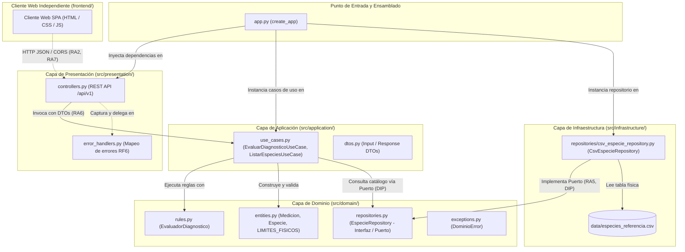
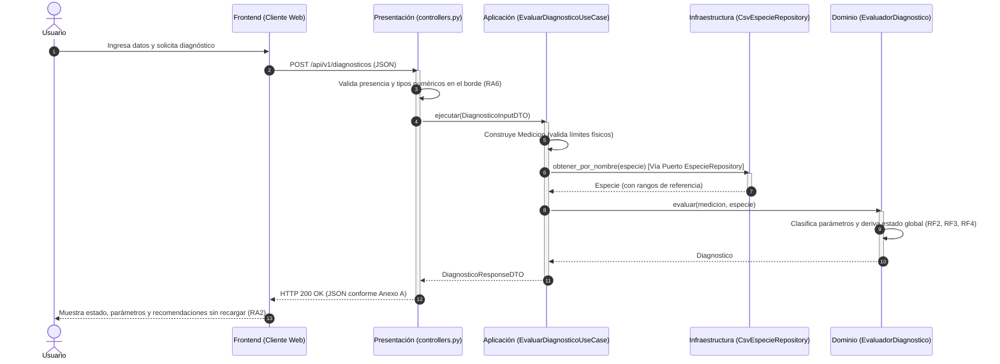

# Documento de Arquitectura de Software
## Sistema de Diagnóstico del Estado de Plantas (Matera Inteligente)
**Semestre 2026-2**

---

## 1. Diagrama de Paquetes / Componentes

El siguiente diagrama representa la estructura de componentes del repositorio, organizada en un cliente web independiente y cuatro capas en el backend con la dirección de dependencias orientada hacia el dominio:

---

## 2. Diagrama de Secuencia: Petición de Diagnóstico

Recorrido de ejecución completo para la operación de diagnóstico botánico (`POST /api/v1/diagnosticos`), nombrando los componentes y clases reales del repositorio:

---

## 3. Tabla de Responsabilidades por Capa

Cada capa tiene una única razón para cambiar y depende exclusivamente de capas más internas. Las prohibiciones de la tercera columna son verificables sobre el código mediante la inspección de los `import` de cada paquete.

| Capa | Qué hace (Responsabilidades) | Qué tiene PROHIBIDO hacer | De qué depende |
| :--- | :--- | :--- | :--- |
| **Presentación** (`src/presentation/`) | Expone los endpoints REST (`POST /api/v1/diagnosticos`, `GET /api/v1/especies`), recibe peticiones HTTP, valida tipos básicos en el borde del sistema, mapea errores a respuestas JSON con código de estado HTTP adecuado (RF6). | Renderizar HTML o plantillas de servidor (**RA1**), contener lógica de negocio o reglas de salud vegetal, acceder a archivos o bases de datos directamente. | Capa de **Aplicación** (Casos de Uso y DTOs) y excepciones de **Dominio**. |
| **Aplicación** (`src/application/`) | Orquesta los casos de uso (`EvaluarDiagnosticoUseCase`, `ListarEspeciesUseCase`), coordina la conversión entre DTOs y entidades de dominio, y consulta los datos mediante el puerto de repositorio. | Depender de frameworks web (Flask, Django), conocer detalles de persistencia (CSV, SQL), generar respuestas HTTP o conocer requests de red. | Capa de **Dominio** (Entidades, Excepciones, Reglas y Abstracciones de Repositorio). |
| **Dominio** (`src/domain/`) | Encapsula las entidades puras (`Medicion`, `Especie`), declara en `LIMITES_FISICOS` el catálogo de variables ambientales soportadas y sus invariantes físicas, deriva el **estado global** de la planta (RF3), clasifica variables (RF2), genera recomendaciones botánicas (RF4) y declara el contrato abstracto `EspecieRepository` (**RA5**). | Importar bibliotecas web (Flask, FastAPI), importar bibliotecas de persistencia (CSV, SQLite, Pandas), depender de capas externas (**RA4**). El dominio es 100% puro y corre en cualquier entorno. | **De nada** (únicamente de la biblioteca estándar de Python: `typing`, `dataclasses`, `enum`, `abc`). |
| **Infraestructura** (`src/infrastructure/`) | Implementa los adaptadores concretos de persistencia (`CsvEspecieRepository`) leyendo la tabla de referencia del CSV, gestiona cachés de acceso a datos y realiza operaciones de E/S física. | Decidir si una planta está sana o enferma, alterar reglas de clasificación de negocio, exponer controladores HTTP. | Capa de **Dominio** (implementa la interfaz abstracta `EspecieRepository` y produce entidades `Especie`). |
| **Frontend** (`frontend/`) | Cliente web SPA desacoplado (`config.js`, `api.js`, `ui.js`, `app.js`): construye el formulario dinámicamente desde el catálogo (RF5), realiza peticiones asíncronas (`fetch`) sin recargar la página (**RA2**), y presenta el diagnóstico y los errores al usuario. | Conocer lógica de negocio agronómica o validar rangos biológicos en el cliente (la autoridad es del backend). | De la URL del backend (`config.js`) y del contrato JSON expuesto por la Capa de Presentación. |

---

## 4. Justificación de Principios SOLID

El criterio que guio el diseño es que un cambio en el mecanismo de entrada (HTTP, MQTT) o en el mecanismo de almacenamiento (CSV, base de datos) no debe propagarse hacia las reglas de negocio. A continuación se justifica cada principio con referencia a archivo y línea del repositorio.

### Single Responsibility Principle (SRP)
- **Dónde se aplica:**
  - `src/domain/rules.py` (Líneas 19–114): La clase `EvaluadorDiagnostico` tiene una única razón para cambiar: cambios en las reglas agronómicas de evaluación o en la derivación del estado global de la planta.
  - `src/infrastructure/repositories/csv_especie_repository.py` (Líneas 18–79): La clase `CsvEspecieRepository` solo cambia si varía el formato del archivo CSV o la estrategia de lectura del disco.
  - `src/presentation/controllers.py` (Líneas 15–71): Los controladores solo cambian si se modifican los contratos de transporte REST o la serialización HTTP.
- **Qué habría pasado de no aplicarlo:** Si una sola clase o script (`app.py` monolítico) leyera el CSV, calculara el estado y emitiera la respuesta HTTP, un cambio en el delimitador del archivo de texto rompería o exigiría re-probar la lógica de diagnóstico botánico y el endpoint web.

### Open/Closed Principle (OCP)
- **Dónde se aplica:**
  - `src/domain/entities.py` (Líneas 44–49): El dominio declara en `LIMITES_FISICOS` el catálogo de variables ambientales soportadas y deriva de él `PARAMETROS_SOPORTADOS` (L53).
  - `src/domain/rules.py` (Líneas 67–100): `evaluar()` no enumera parámetros fijos; itera sobre `especie.rangos` (L77). Tanto `Especie.rangos` (L69–81) como `Medicion.valores` (L84–129) son colecciones indexadas por nombre (`Mapping`), no atributos estáticos acoplados.
  - `src/infrastructure/repositories/csv_especie_repository.py` (Líneas 28, 35–37, 51–63): Las columnas del CSV se derivan dinámicamente (`{parametro}_min` / `{parametro}_max`), requiriendo solo `_PREFIJOS_CSV` para la abreviación de temperatura del Anexo B.
  - `src/presentation/controllers.py` (Líneas 49–52): El endpoint valida y exige los parámetros publicados dinámicamente por el dominio.
  - `src/domain/repositories.py` (Líneas 10–24): La abstracción `EspecieRepository` permite incorporar nuevos orígenes de datos (PostgreSQL, dobles de prueba) sin modificar la capa consumidora.
- **Verificación y Extensibilidad:** Agregar un nuevo parámetro ambiental (por ejemplo, pH del sustrato) requiere intervenir únicamente dos archivos: añadir la clave en `LIMITES_FISICOS` y agregar las columnas correspondientes en `data/especies_referencia.csv`. Ni el evaluador de reglas, ni los DTOs, ni los casos de uso, ni los controladores requieren modificación.
- **Tensión de diseño reconocida:** El cálculo y flujo de evaluación quedan cerrados a modificación, pero el catálogo de textos específicos en `EvaluadorDiagnostico._RECOMENDACIONES` (L31–44) requeriría edición si se desea una redacción personalizada para el nuevo parámetro; de lo contrario, aplica la recomendación genérica de `_generar_recomendacion()` (L59–64). Se asumió conscientemente para no acoplar el dominio a persistencia externa de cadenas.
- **Qué habría pasado de no aplicarlo:** Si `Especie` y `Medicion` usaran atributos fijos (`rango_humedad`, `rango_luz`, etc.), añadir una variable obligaría a modificar entidades, repositorios, evaluadores, casos de uso, DTOs y controladores, violando el cierre ante cambios.

### Liskov Substitution Principle (LSP)
- **Dónde se aplica:**
  - `src/domain/repositories.py` (Líneas 10–24) vs `src/infrastructure/repositories/csv_especie_repository.py` (Líneas 18–79) y `tests/doubles.py` (Líneas 29–46): Tanto `CsvEspecieRepository` como `FakeEspecieRepository` implementan `EspecieRepository`.
  - El caso de uso `EvaluarDiagnosticoUseCase` (`src/application/use_cases.py`, Líneas 20–57; constructor L27–28) recibe `EspecieRepository` y funciona idénticamente con la implementación física o con el doble en memoria, cumpliendo los mismos contratos de entrada y salida sin lanzar excepciones inesperadas que rompan el cliente.
- **Qué habría pasado de no aplicarlo:** Si la implementación concreta de CSV lanzara excepciones específicas de archivo que la capa de aplicación tuviera que capturar con bloques `try/except csv.Error`, no se podría sustituir por un repositorio en base de datos o por un doble de pruebas sin modificar la capa de aplicación.

### Interface Segregation Principle (ISP)
- **Dónde se aplica:**
  - `src/domain/repositories.py` (Líneas 10–24): La interfaz `EspecieRepository` es pequeña y especializada. Contiene única y exclusivamente los dos métodos que el dominio requiere: `obtener_por_nombre(nombre)` y `obtener_todas()`.
- **Tensión / Decisión consciente:** No se forzó una interfaz genérica de repositorio CRUD con métodos que el dominio actual no necesita (`guardar()`, `eliminar()`, `actualizar()`, `paginar()`). Las clases implementadoras solo escriben código relevante para la lectura de especies.
- **Qué habría pasado de no aplicarlo:** Si se hubiera utilizado una interfaz de repositorio estándar con 10 métodos no utilizados, `CsvEspecieRepository` y los dobles de prueba estarían obligados a implementar métodos vacíos o lanzar `NotImplementedError`, ensuciando el diseño.

### Dependency Inversion Principle (DIP)
- **Dónde se aplica:**
  - Es la formalización de **RA5**. El caso de uso de aplicación (`src/application/use_cases.py`, Líneas 27–28) depende de la abstracción `EspecieRepository` definida en `src/domain/repositories.py` (Líneas 10–24).
  - La implementación física `CsvEspecieRepository` vive en la capa de infraestructura (`src/infrastructure/repositories/csv_especie_repository.py`, Línea 18) y depende de la interfaz de dominio.
  - La composición final se realiza en `app.py` (Líneas 36–46), donde se inyecta la instancia concreta en el caso de uso y en el blueprint.
- **Qué habría pasado de no aplicarlo:** El caso de uso importaría directamente `CsvEspecieRepository`. Esto haría imposible ejecutar pruebas unitarias del caso de uso sin tener el archivo físico en el disco duro y violaría la restricción **RA4**.

---

## 5. Tabla de Referencia por Especie: Contenido y Fuente

La tabla de referencia (`data/especies_referencia.csv`) cubre cinco especies, el mínimo exigido, con el formato del Anexo B del enunciado:

| Especie | Humedad (%) | Luz (lux) | Temperatura (°C) |
| :--- | :--- | :--- | :--- |
| sansevieria | 20 – 45 | 200 – 1500 | 15 – 29 |
| potos | 40 – 70 | 300 – 1200 | 18 – 30 |
| suculenta | 10 – 30 | 800 – 2500 | 15 – 32 |
| helecho | 60 – 85 | 150 – 800 | 16 – 26 |
| lavanda | 25 – 50 | 1000 – 3000 | 15 – 30 |

**Fuente:** los valores fueron tomados íntegramente del **Anexo B del enunciado del proyecto de corte** (*Formato de la tabla de referencia*), sin modificación. No realizamos una verificación agronómica independiente de los rangos: el objeto de este corte es la separación entre la tabla y la lógica que la consume, no la exactitud botánica del dato. Esa decisión es en sí misma una demostración del diseño: corregir cualquiera de estos rangos contra una fuente especializada es editar un archivo CSV y no requiere tocar una sola línea de código.

Las unidades no viven en el CSV: las declara el dominio en `LIMITES_FISICOS` (`src/domain/entities.py` Líneas 44–49) y la infraestructura las adjunta al construir cada `RangoParametro`.

---

## 6. Plan de Evolución

### Escenario A: Mediciones llegan por MQTT desde un ESP32
* **Qué componentes se agregan:**
  - Un nuevo adaptador de entrada en la capa de presentación: `src/presentation/mqtt_subscriber.py`, utilizando una biblioteca cliente MQTT (e.g. `paho-mqtt`).
  - Un DTO o traductor que convierta el payload JSON recibido en el tópico MQTT a `DiagnosticoInputDTO`.
  - Un script de ejecución o servicio daemon para el listener MQTT (e.g., `mqtt_runner.py`).
* **Qué componentes se modifican:**
  - Ninguno en las capas de negocio. Opcionalmente `app.py` para registrar el cliente MQTT en segundo plano o gestionar variables de entorno de red.
* **Qué componentes NO se tocan:**
  - La totalidad de la capa de dominio: `src/domain/entities.py`, `src/domain/rules.py`, `src/domain/exceptions.py`.
  - La totalidad de la capa de aplicación: `src/application/use_cases.py` (`EvaluarDiagnosticoUseCase` es agnóstico al protocolo de transporte y se reutiliza idénticamente).
  - La capa de infraestructura CSV: `src/infrastructure/repositories/csv_especie_repository.py`.

### Escenario B: La tabla de referencia migra de CSV a una Base de Datos Relacional (PostgreSQL)
* **Qué componentes se agregan:**
  - Una nueva clase en la capa de infraestructura: `src/infrastructure/repositories/postgres_especie_repository.py`, que implementa `EspecieRepository` mediante SQL o un conector ligero (e.g. `psycopg2` / `SQLAlchemy core`).
  - Script SQL de migración y creación de tabla con los datos semilla de las especies.
* **Qué componentes se modifican:**
  - Exclusivamente una línea en `app.py`: en lugar de instanciar `CsvEspecieRepository`, se instancia `PostgresEspecieRepository(connection_string)`.
* **Qué componentes NO se tocan:**
  - La interfaz `EspecieRepository` declarada en el dominio.
  - Los casos de uso (`EvaluarDiagnosticoUseCase`, `ListarEspeciesUseCase`).
  - Todas las entidades y reglas del dominio.
  - Todos los controladores REST de la capa de presentación y el frontend.

### Escenario C: Aparecen Usuarios, cada uno con varias Plantas
* **Qué componentes se agregan:**
  - Nuevas entidades en el dominio: `Usuario` y `PlantaUsuario` (identificador, apodo, especie asociada, usuario_id).
  - Nuevas abstracciones de puerto en el dominio: `UsuarioRepository` y `PlantaUsuarioRepository`.
  - Nuevos casos de uso en aplicación: `RegistrarPlantaUseCase`, `ListarPlantasUsuarioUseCase`.
  - Nuevas tablas e implementaciones en infraestructura para la persistencia de usuarios y plantas.
  - Nuevos endpoints REST en presentación: `/api/v1/usuarios` y `/api/v1/plantas`.
* **Qué componentes se modifican:**
  - En el caso de uso `EvaluarDiagnosticoUseCase`, se puede opcionalmente recibir el `planta_id` para resolver la especie asociada en lugar de recibirla directamente.
* **Qué componentes NO se tocan:**
  - `EvaluadorDiagnostico`: la regla para determinar si una humedad o temperatura es óptima o peligrosa no cambia en función de quién sea el dueño de la planta.
  - `Medicion` y los límites físicos de las variables.
  - La definición de especie y sus rangos de referencia.

### Escenario D: Se agrega Gamificación (Puntos, Rachas, Niveles) sobre el Cuidado
* **Qué componentes se agregan:**
  - Un nuevo bounded context / paquete de gamificación independiente: `src/gamification/` con entidades `Puntaje`, `RachaCuidado`, `Nivel` y reglas de otorgamiento de insignias.
  - Un mecanismo de eventos de dominio en aplicación: `DiagnosticoGeneradoEvent`.
  - Un suscriptor / listener de evento: `GamificacionListener`, que incrementa la racha cuando el estado global es `SALUDABLE` o la penaliza si es `CRITICO`.
* **Qué componentes se modifican:**
  - El caso de uso `EvaluarDiagnosticoUseCase` para emitir el evento `DiagnosticoGeneradoEvent` tras completar el diagnóstico.
* **Qué componentes NO se tocan:**
  - `src/domain/rules.py` y `src/domain/entities.py`. La botánica no conoce qué es un "nivel", una "racha" o una "medalla". Mezclar gamificación dentro del evaluador de plantas violaría el SRP y contaminaría el núcleo biológico.

---

## 7. Decisiones de Diseño y Alternativas Descartadas

### Decisión 1: Abstracción de Repositorio en Dominio vs Carga Directa de Datos en Casos de Uso
* **Opción adoptada:** Declarar la interfaz abstracta `EspecieRepository` en `src/domain/repositories.py` e implementarla en `src/infrastructure/repositories/csv_especie_repository.py` (Inversión de Dependencias - DIP / RA5).
* **Alternativa descartada:** Leer directamente el CSV en el constructor del caso de uso o mediante funciones globales en un módulo utilitario.
* **Razón del descarte:** La alternativa descartada acoplaba fuertemente la lógica del sistema al sistema de archivos y al formato CSV. Habría hecho imposible probar los casos de uso sin crear archivos temporales en el disco duro y obligaría a modificar la capa de aplicación al migrar a una base de datos relacional (violando RA4 y RA5).

### Decisión 2: Cliente Web Estático Desacoplado vs Renderizado de Plantillas con Jinja en Flask
* **Opción adoptada:** Cliente web SPA estático e independiente en `frontend/` (HTML, CSS y JS puro) consumiendo la API de Flask vía `fetch` asíncrono con CORS habilitado (RA1, RA2, RA7).
* **Alternativa descartada:** Renderizado del formulario y de la tabla de resultados utilizando `render_template` de Jinja2 servido directamente por las rutas de Flask.
* **Razón del descarte:** El renderizado del lado del servidor genera un acoplamiento monolítico entre la interfaz gráfica y el backend. Además de estar explícitamente prohibido bajo causal de descalificación por la restricción **RA1**, impedía que clientes futuros (como la aplicación móvil o paneles IoT) reutilizaran el servicio sin recibir código HTML mezclado con los datos.

### Decisión 3: Validación de Invariantes Físicos en Entidades de Dominio vs Validación en Frontend / Controlador
* **Opción adoptada:** Validación en dos barreras: el controlador REST valida obligatoriedad y formato de tipos (RA6), y la entidad de dominio `Medicion` (`src/domain/entities.py`) valida los invariantes y límites físicos de supervivencia y medición (RF6).
* **Alternativa descartada:** Validar únicamente en el formulario HTML con JavaScript o validar los rangos físicos con condiciones sueltas dentro de la ruta de Flask.
* **Razón del descarte:** Si la validación reside solo en el front o en el controlador HTTP, al ingresar datos por MQTT desde el ESP32 o desde una prueba unitaria, el sistema podría procesar datos absurdos (como 500% de humedad o lux negativo). El dominio debe proteger su propia consistencia e invariantes independientemente de la vía de entrada.

### Decisión 4: Parámetros como Colección Indexada vs Campos Fijos en las Entidades
* **Opción adoptada:** `Especie.rangos` y `Medicion.valores` son colecciones indexadas por nombre de parámetro (`Mapping[str, ...]`), y el dominio publica el catálogo de variables soportadas en `LIMITES_FISICOS` (`src/domain/entities.py` Líneas 44–49). El evaluador recorre lo que la especie declara.
* **Alternativa descartada:** Mantener tres atributos fijos por entidad (`humedad`, `luz`, `temperatura`), que era el diseño original del repositorio.
* **Razón del descarte:** Con campos fijos, agregar una cuarta variable obligaba a modificar siete archivos, entre ellos `EvaluadorDiagnostico`, lo que contradecía nuestra propia afirmación de OCP. Con la colección son dos, y ninguno es el evaluador.
* **Costo asumido:** se pierde el acceso por atributo (`medicion.humedad` pasa a `medicion.valor_de("humedad")`) y con él la detección de errores de tipeo en tiempo de escritura. Lo compensamos haciendo que `Medicion` valide en su constructor que cada clave exista en `LIMITES_FISICOS` (L104–108): un nombre inválido falla al construir la entidad, con el campo señalado, y no silenciosamente durante la evaluación.
* **Nota sobre RA6:** `Medicion.valores` no es un diccionario crudo. `Medicion` es un objeto de valor que sólo puede existir si supera sus invariantes (parámetro reconocido, valor numérico, valor físicamente posible) y congela su contenido con `MappingProxyType` (L122). El diccionario es su representación interna; su contrato de entrada es el constructor que valida.

### Decisión 5: Front Separado en Capas vs Un Único Archivo de Script
* **Opción adoptada:** Dividir el cliente en cuatro archivos con una responsabilidad cada uno: `config.js` (dirección del backend), `api.js` (`PlantApi`, único que usa `fetch` y lee códigos HTTP), `ui.js` (`PlantUI`, único que toca el DOM) y `app.js` (orquestación). Los campos de medición del formulario se generan a partir del catálogo de RF5.
* **Alternativa descartada:** Mantener `script.js`, un único archivo que mezclaba la configuración, las peticiones, el renderizado y el manejo de errores, con los tres campos escritos a mano en `index.html`.
* **Razón del descarte:** La separación del backend perdía sentido si el cliente concentraba todo en un archivo. Con la división, `ui.js` no sabe que existe HTTP —recibe datos ya resueltos y devuelve lo que el usuario escribió— del mismo modo que el dominio no sabe que existe Flask. Además, con los campos escritos a mano, agregar una variable ambiental obligaba a editar el HTML y el JS; al generarlos desde RF5, el front la incorpora sin cambios.
* **Costo asumido:** el front hace cuatro peticiones de script en lugar de una y las etiquetas de los campos se derivan del nombre y la unidad que envía la API (`Humedad (%)`), en vez de textos redactados a mano. Para un cliente de este tamaño, servido localmente, ninguno de los dos costos es significativo.

