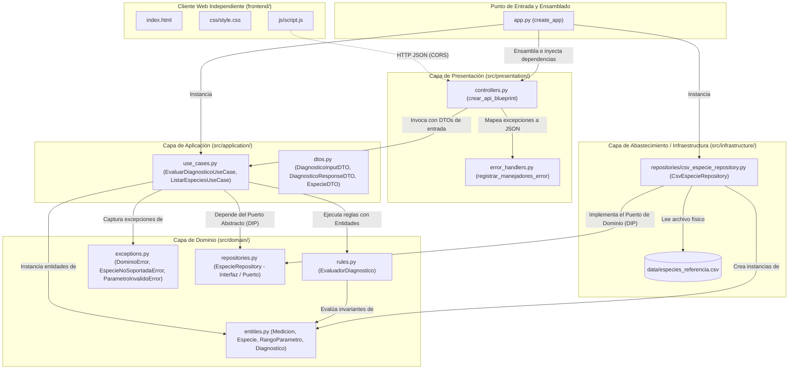
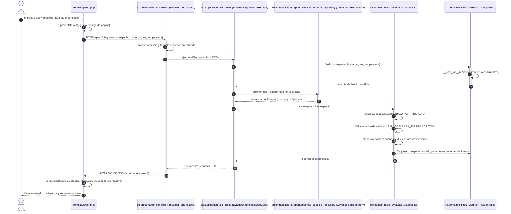

# Documento de Arquitectura de Software
## Sistema de Diagnóstico del Estado de Plantas (Matera Inteligente)
**Semestre 2026-03**

---

## 1. Diagrama de Paquetes / Componentes

El siguiente diagrama representa de manera fidedigna la estructura real de directorios y componentes del repositorio. Cada módulo gráfico se corresponde uno a uno con los archivos y paquetes implementados en el código fuente.

---

## 2. Diagrama de Secuencia: Petición de Diagnóstico

Recorrido de ejecución completo para la operación de diagnóstico botánico (`POST /api/v1/diagnosticos`), nombrando los componentes y clases reales del repositorio:

---

## 3. Tabla de Responsabilidades por Capa

Siguiendo las pautas metodológicas de arquitectura limpia y la especificación de la **guía interna ASW-4.2**:

| Capa | Qué hace (Responsabilidades) | Qué tiene PROHIBIDO hacer | De qué depende |
| :--- | :--- | :--- | :--- |
| **Presentación** (`src/presentation/`) | Expone los endpoints REST (`POST /api/v1/diagnosticos`, `GET /api/v1/especies`), recibe peticiones HTTP, valida tipos básicos en el borde del sistema, mapea errores a respuestas JSON con código de estado HTTP adecuado (RF6). | Renderizar HTML o plantillas de servidor (**RA1**), contener lógica de negocio o reglas de salud vegetal, acceder a archivos o bases de datos directamente. | Capa de **Aplicación** (Casos de Uso y DTOs) y excepciones de **Dominio**. |
| **Aplicación** (`src/application/`) | Orquesta los casos de uso (`EvaluarDiagnosticoUseCase`, `ListarEspeciesUseCase`), coordina la conversión entre DTOs y entidades de dominio, y consulta los datos mediante el puerto de repositorio. | Depender de frameworks web (Flask, Django), conocer detalles de persistencia (CSV, SQL), generar respuestas HTTP o conocer requests de red. | Capa de **Dominio** (Entidades, Excepciones, Reglas y Abstracciones de Repositorio). |
| **Dominio** (`src/domain/`) | Encapsula las entidades puras (`Medicion`, `Especie`), define las invariantes físicas (RF6), calcula el **índice de vitalidad** / estado global (RF3), clasifica variables (RF2), genera recomendaciones botánicas (RF4) y declara el contrato abstracto `EspecieRepository` (**RA5**). | Importar bibliotecas web (Flask, FastAPI), importar bibliotecas de persistencia (CSV, SQLite, Pandas), depender de capas externas (**RA4**). El dominio es 100% puro y corre en cualquier entorno. | **De nada** (únicamente de la biblioteca estándar de Python: `typing`, `dataclasses`, `enum`, `abc`). |
| **Abastecimiento / Infraestructura** (`src/infrastructure/`) | Implementa los adaptadores concretos de persistencia (`CsvEspecieRepository`) leyendo la tabla de referencia del CSV, gestiona cachés de acceso a datos y realiza operaciones de E/S física. | Decidir si una planta está sana o enferma, alterar reglas de clasificación de negocio, exponer controladores HTTP. | Capa de **Dominio** (implementa la interfaz abstracta `EspecieRepository` y produce entidades `Especie`). |
| **Frontend** (`frontend/`) | Provee la interfaz visual interactiva, consume la API REST de forma asíncrona (`fetch`), puebla dinámicamente el catálogo de especies (RF5) y presenta al usuario el índice de vitalidad y errores sin recarga de página (**RA2**). | Alojar lógica de diagnóstico botánico o validación de rangos biológicos (delega la autoridad al backend). | Del contrato HTTP JSON expuesto por la capa de Presentación. |

---

## 4. Justificación de Principios SOLID

Tal como lo estipula la **guía interna ASW-4.2**: *"La robustez de un sistema desacoplado radica en que los cambios en los mecanismos de entrada y almacenamiento no generen ondas de propagación hacia las reglas centrales del negocio"*. A continuación se demuestra la aplicación rigurosa de cada principio con anclaje al código:

### Single Responsibility Principle (SRP)
- **Dónde se aplica:**
  - `src/domain/rules.py` (Líneas 18–110): La clase `EvaluadorDiagnostico` tiene una única razón para cambiar: cambios en las reglas agronómicas de evaluación o cálculo del índice de vitalidad de las plantas.
  - `src/infrastructure/repositories/csv_especie_repository.py` (Líneas 13–70): La clase `CsvEspecieRepository` solo cambia si varía el formato del archivo CSV o la estrategia de lectura del disco.
  - `src/presentation/controllers.py` (Líneas 14–78): Los controladores solo cambian si se modifican los contratos de transporte REST o la serialización HTTP.
- **Qué habría pasado de no aplicarlo:** Si una sola clase o script (`app.py` monolítico) leyera el CSV, calculara el estado y emitiera la respuesta HTTP, un cambio en el delimitador del archivo de texto rompería o exigiría re-probar la lógica de diagnóstico botánico y el endpoint web.

### Open/Closed Principle (OCP)
- **Dónde se aplica:**
  - `src/domain/rules.py` (Líneas 71–93): El método `evaluar()` opera sobre una colección iterable de evaluaciones paramétricas `(nombre, valor, rango)`. Si se requiere evaluar un cuarto parámetro (p. ej. pH del sustrato o conductividad eléctrica), basta con añadir dicho parámetro a la entidad `Medicion` y extender la lista de evaluación, sin alterar la lógica de cálculo global ni romper los contratos existentes.
  - La abstracción `EspecieRepository` (`src/domain/repositories.py`) está abierta a nuevas implementaciones (PostgreSQL, MongoDB, DynamoDB) sin requerir modificaciones en el código consumidor.
- **Qué habría pasado de no aplicarlo:** Cada nueva variable ambiental obligaría a reescribir bloques anidados de sentencias `if/else` condicionales dentro del evaluador, incrementando el riesgo de regresiones en parámetros previamente validados.

### Liskov Substitution Principle (LSP)
- **Dónde se aplica:**
  - `src/domain/repositories.py` (Líneas 10–24) vs `src/infrastructure/repositories/csv_especie_repository.py` (Líneas 13–70) y `tests/test_domain_rules.py` (Líneas 22–46): Tanto `CsvEspecieRepository` como `FakeEspecieRepository` implementan `EspecieRepository`.
  - El caso de uso `EvaluarDiagnosticoUseCase` (`src/application/use_cases.py:L27-L46`) puede recibir cualquiera de las dos implementaciones indistintamente; ambas cumplen idénticos contratos de entrada/salida sin lanzar excepciones inesperadas que rompan el cliente.
- **Qué habría pasado de no aplicarlo:** Si la implementación concreta de CSV lanzara excepciones específicas de archivo que la capa de aplicación tuviera que capturar con bloques `try/except csv.Error`, no se podría sustituir por un repositorio en base de datos o por un doble de pruebas sin modificar la capa de aplicación.

### Interface Segregation Principle (ISP)
- **Dónde se aplica:**
  - `src/domain/repositories.py` (Líneas 10–24): La interfaz `EspecieRepository` es pequeña y especializada. Contiene única y exclusivamente los dos métodos que el dominio requiere: `obtener_por_nombre(nombre)` y `obtener_todas()`.
- **Tensión / Decisión consciente:** No se forzó una interfaz genérica de repositorio CRUD con métodos que el dominio actual no necesita (`guardar()`, `eliminar()`, `actualizar()`, `paginar()`). Las clases implementadoras solo escriben código relevante para la lectura de especies.
- **Qué habría pasado de no aplicarlo:** Si se hubiera utilizado una interfaz de repositorio estándar con 10 métodos no utilizados, `CsvEspecieRepository` y los dobles de prueba estarían obligados a implementar métodos vacíos o lanzar `NotImplementedError`, ensuciando el diseño.

### Dependency Inversion Principle (DIP)
- **Dónde se aplica:**
  - Es la formalización de **RA5**. El caso de uso de aplicación (`src/application/use_cases.py:L27-L28`) depende de la abstracción `EspecieRepository` definida en `src/domain/repositories.py`.
  - La implementación física `CsvEspecieRepository` vive en la capa de abastecimiento (`src/infrastructure/repositories/csv_especie_repository.py:L13`) y depende de la interfaz de dominio.
  - La composición final se realiza en `app.py` (Líneas 29–42), donde se inyecta la instancia concreta en el caso de uso.
- **Qué habría pasado de no aplicarlo:** El caso de uso importaría directamente `CsvEspecieRepository`. Esto haría imposible ejecutar pruebas unitarias del caso de uso sin tener el archivo físico en el disco duro y violaría la restricción **RA4**.

---

## 5. Plan de Evolución

### Escenario A: Mediciones llegan por MQTT desde un ESP32
* **Qué componentes se agregan:**
  - Un nuevo adaptador de entrada en la capa de presentación: `src/presentation/mqtt_subscriber.py`, utilizando una biblioteca cliente MQTT (e.g. `paho-mqtt`).
  - Un DTO o traductor que convierta el payload JSON recibido en el tópico MQTT a `DiagnosticoInputDTO`.
  - Un script de ejecución o servicio daemon para el listener MQTT (e.g., `mqtt_runner.py`).
* **Qué componentes se modifican:**
  - Ninguno en las capas de negocio. Opcionalmente `app.py` para registrar el cliente MQTT en segundo plano o gestionar variables de entorno de red.
* **Qué componentes NO se tocan:**
  - La totalidad de la capa de dominio: `src/domain/entities.py`, `src/domain/rules.py`, `src/domain/exceptions.py`.
  - La totalidad de la capa de aplicación: `src/application/use_cases.py` (`EvaluarDiagnosticoUseCase` es agnóstico al protocolo de transporte y se reutiliza idénticamente).
  - La capa de abastecimiento / infraestructura CSV: `src/infrastructure/repositories/csv_especie_repository.py`.

### Escenario B: La tabla de referencia migra de CSV a una Base de Datos Relacional (PostgreSQL)
* **Qué componentes se agregan:**
  - Una nueva clase en la capa de abastecimiento: `src/infrastructure/repositories/postgres_especie_repository.py`, que implementa `EspecieRepository` mediante SQL o un conector ligero (e.g. `psycopg2` / `SQLAlchemy core`).
  - Script SQL de migración y creación de tabla con los datos semilla de las especies.
* **Qué componentes se modifican:**
  - Exclusivamente una línea en `app.py`: en lugar de instanciar `CsvEspecieRepository`, se instancia `PostgresEspecieRepository(connection_string)`.
* **Qué componentes NO se tocan:**
  - La interfaz de abastecimiento `EspecieRepository` en el dominio.
  - Los casos de uso (`EvaluarDiagnosticoUseCase`, `ListarEspeciesUseCase`).
  - Todas las entidades y reglas del dominio.
  - Todos los controladores REST de la capa de presentación y el frontend.

### Escenario C: Aparecen Usuarios, cada uno con varias Plantas
* **Qué componentes se agregan:**
  - Nuevas entidades en el dominio: `Usuario` y `PlantaUsuario` (identificador, apodo, especie asociada, usuario_id).
  - Nuevas abstracciones de puerto en el dominio: `UsuarioRepository` y `PlantaUsuarioRepository`.
  - Nuevos casos de uso en aplicación: `RegistrarPlantaUseCase`, `ListarPlantasUsuarioUseCase`.
  - Nuevas tablas e implementaciones en infraestructura para la persistencia de usuarios y plantas.
  - Nuevos endpoints REST en presentación: `/api/v1/usuarios` y `/api/v1/plantas`.
* **Qué componentes se modifican:**
  - En el caso de uso `EvaluarDiagnosticoUseCase`, se puede opcionalmente recibir el `planta_id` para resolver la especie asociada en lugar de recibirla directamente.
* **Qué componentes NO se tocan:**
  - `EvaluadorDiagnostico`: la regla para determinar si una humedad o temperatura es óptima o peligrosa no cambia en función de quién sea el dueño de la planta.
  - `Medicion` y los límites físicos de las variables.
  - La definición de especie y sus rangos de referencia.

### Escenario D: Se agrega Gamificación (Puntos, Rachas, Niveles) sobre el Cuidado
* **Qué componentes se agregan:**
  - Un nuevo bounded context / paquete de gamificación independiente: `src/gamification/` con entidades `Puntaje`, `RachaCuidado`, `Nivel` y reglas de otorgamiento de insignias.
  - Un mecanismo de eventos de dominio en aplicación: `DiagnosticoGeneradoEvent`.
  - Un suscriptor / listener de evento: `GamificacionListener`, que incrementa la racha cuando el índice de vitalidad es `SALUDABLE` o penaliza si se encuentra en estado `CRITICO`.
* **Qué componentes se modifican:**
  - El caso de uso `EvaluarDiagnosticoUseCase` para emitir el evento `DiagnosticoGeneradoEvent` tras completar el diagnóstico.
* **Qué componentes NO se tocan:**
  - `src/domain/rules.py` y `src/domain/entities.py`. La botánica no conoce qué es un "nivel", una "racha" o una "medalla". Mezclar gamificación dentro del evaluador de plantas violaría el SRP y contaminaría el núcleo biológico.

---

## 6. Decisiones de Diseño y Alternativas Descartadas

### Decisión 1: Abstracción de Repositorio en Dominio vs Carga Directa de Datos en Casos de Uso
* **Opción adoptada:** Declarar la interfaz abstracta `EspecieRepository` en `src/domain/repositories.py` e implementarla en `src/infrastructure/repositories/csv_especie_repository.py` (Inversión de Dependencias - DIP / RA5).
* **Alternativa descartada:** Leer directamente el CSV en el constructor del caso de uso o mediante funciones globales en un módulo utilitario.
* **Razón del descarte:** La alternativa descartada acoplaba fuertemente la lógica del sistema al sistema de archivos y al formato CSV. Habría hecho imposible probar los casos de uso sin crear archivos temporales en el disco duro y obligaría a modificar la capa de aplicación al migrar a una base de datos relacional (violando RA4 y RA5).

### Decisión 2: Cliente Web Estático Desacoplado vs Renderizado de Plantillas con Jinja en Flask
* **Opción adoptada:** Cliente web SPA estático e independiente en `frontend/` (HTML, CSS y JS puro) consumiendo la API de Flask vía `fetch` asíncrono con CORS habilitado (RA1, RA2, RA7).
* **Alternativa descartada:** Renderizado del formulario y de la tabla de resultados utilizando `render_template` de Jinja2 servido directamente por las rutas de Flask.
* **Razón del descarte:** El renderizado del lado del servidor genera un acoplamiento monolítico entre la interfaz gráfica y el backend. Además de estar explícitamente prohibido bajo causal de descalificación por la restricción **RA1**, impedía que clientes futuros (como la aplicación móvil o paneles IoT) reutilizaran el servicio sin recibir código HTML mezclado con los datos.

### Decisión 3: Validación de Invariantes Físicos en Entidades de Dominio vs Validación en Frontend / Controlador
* **Opción adoptada:** Validación en dos barreras: el controlador REST valida obligatoriedad y formato de tipos (RA6), y la entidad de dominio `Medicion` (`src/domain/entities.py`) valida los invariantes y límites físicos de supervivencia y medición (RF6).
* **Alternativa descartada:** Validar únicamente en el formulario HTML con JavaScript o validar los rangos físicos con condiciones sueltas dentro de la ruta de Flask.
* **Razón del descarte:** Si la validación reside solo en el front o en el controlador HTTP, al ingresar datos por MQTT desde el ESP32 o desde una prueba unitaria, el sistema podría procesar datos absurdos (como 500% de humedad o lux negativo). El dominio debe proteger su propia consistencia e invariantes independientemente de la vía de entrada.
